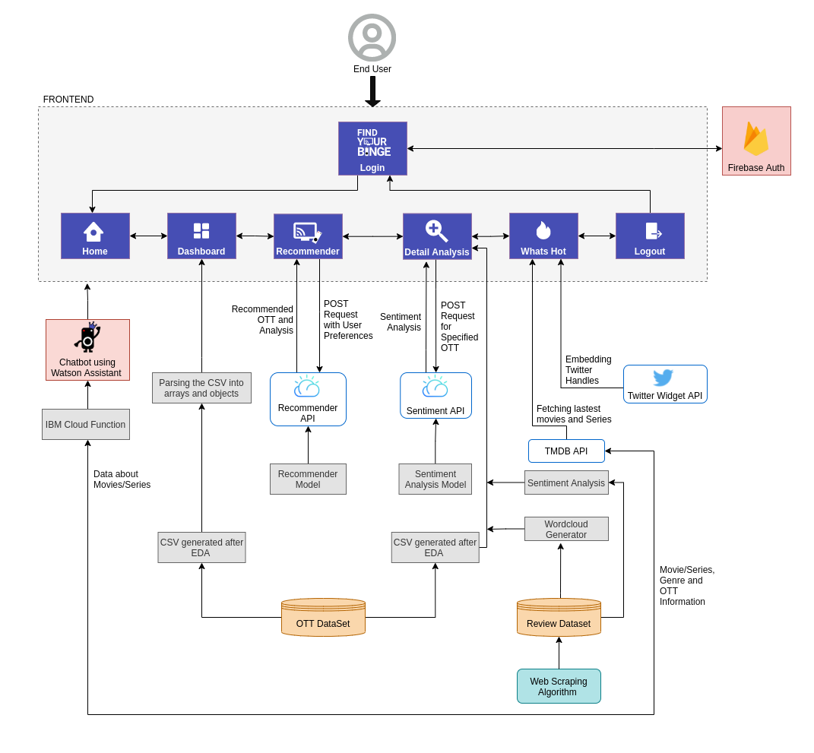
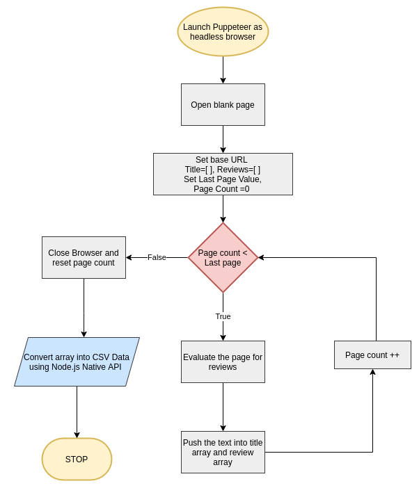
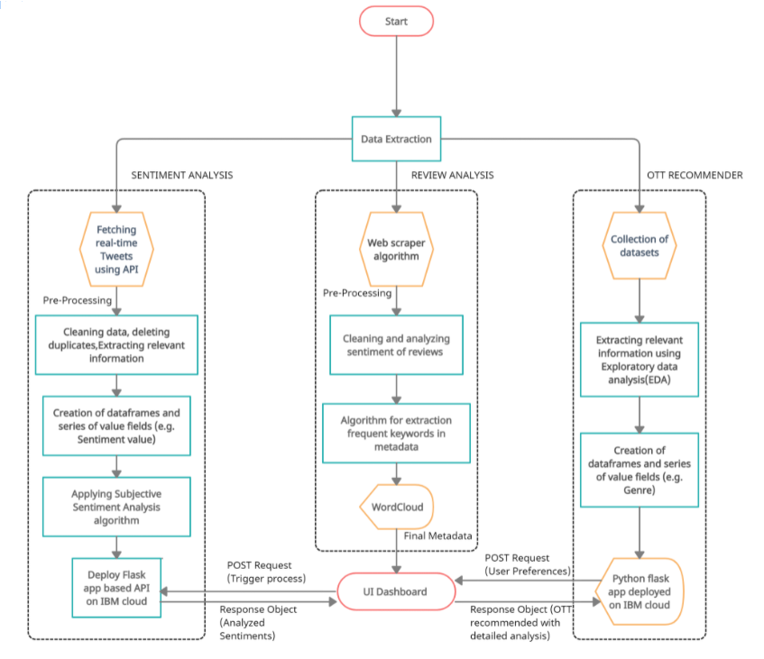

# OTT Platform Analysis Tool

DEMO LINK: [GDrive Link](https://drive.google.com/file/d/1OM4-KkFvs8TQuKc4Difdr6ioaOaCdIq2/view?usp=sharing) or [Youtube Video Link](https://youtu.be/OGjtv8t06w8)

WEBAPP LINK: [Click Here](http://findyourbinge.eu-gb.mybluemix.net/)

Dashboard PDF Link: [Click Here](https://drive.google.com/file/d/11z3Vmdp83k_iLL8-CL-BqXP8cmRtPvax/view?usp=sharing)

Final Report Link: [Click Here](https://drive.google.com/file/d/1T7SeD1ow1PIanTElKZmPDLuaZJkiV0c9/view?usp=sharing)

Datasets Link: [Click Here](https://drive.google.com/drive/folders/1ypjQBA7lbNBPQsgb4fHJlGzj5ItbbPag?usp=sharing)

> Problem Statement: As OTT platforms are coming up with new ways to stand out among competitors by presenting original content, it is evident that more customers are being lost in deciding which platform would be suitable for their use. Moreover, most of the available recommendation systems are focused on suggesting the content but not the platforms that hold and provide those contents. To ease the choice dilemma, our study aims to present a guideline for choosing the appropriate OTT platform that fits one’s personal preferences.

> Solution: Our solution is a web-app called ‘Find Your Binge’ which will help our users to figure out which OTT platform is best suited for them. Our web-app will provide them with comparisons of the top OTT platforms in a visual way so that the user can make some sense of these statistics. It also provides an in-depth analysis of these OTTs and will tell them how people feel about these platforms. It also have a section where the users can tell their perferences and get recommended with a OTT suitable for them and a chatbot for their queries.

#### The app contains the following features:

`Homepage`: The Home page contains information about our web-app and all its features. This page contains information about how OTT is better than Cable. It is an introductory page to our app.

`The Dashboard`: The Dashboard contains different charts for visualising our comparative study between the top 3 OTTs based on the results of our EDA. The charts are interactive and you can remove or add the data with a click. The charts will help the user understand which OTT has what kind of content in a visual manner.

`OTT Recommender`: The OTT Recommender uses Content-based algorithms based recommender system which will process the user's preferences to help select an OTT platform that suits best to users preferences.

`Detail Analysis`: A Detailed Analysis of each OTT (Netflix, Prime Video and Disney+ Hotstar) is presented in a visual manner with extra details.

`People’s Opinion with LIVE Analysis`: Detail Analysis section has a real-time tweet analysis section and a section for the analysis of reviews posted by people about the respective OTTs.

`What’s Hot`: What's Hot provides the latest trending movies and series and information about them like genres and the OTT providers available. It also shows the tweets by the OTT platforms' twitter handles for the user to get up to date with the OTTs are uploading.

`Watson Assistant Chatbot`: We have used the IBM Watson Assistant with IBM Cloud Functions to create a chatbot for the user to enquire on which platform a movie/series is available, movies/series according to genre and provider, information and subscription packages of an OTT.

# OTT- Recommender

A Flask based REST API is created which responds with a recommendation of an OTT platform(s) to the user based on the choices that the user makes.
The result also takes in consideration of the features which are given higher priority by the user.
The various steps involved were:

- Collection of datasets: Various datasets were collected for each OTT platform. The major reference for the data was Kaggle
- We initialise a **[Watson Studio Notebook for Sentiment Analysis](https://eu-gb.dataplatform.cloud.ibm.com/analytics/notebooks/v2/d7f89838-67bc-421b-bf72-ff9c33a5d4eb/view?access_token=05d7c8d20083ba2d73e4cd1d3cff4ef57e7b104bfb679014ecacbe1a0a761992)** for the performing operations pertaining to data cleaning and eventual analysis of OTT platforms.
- After data cleaning, we analyzed the data and performed EDA (Exploratory Data Analysis) to get an idea of different features.
- We needed few common measures of comparison like Language, Age Rating, IMDb and genre, so we resorted to converting them upto a common scale to be compared accordingly
- These features were finally used to formulate our Recommender algorithm.
- The output of recommender is then sent to the UI with the help of Flask framework deployed on IBM cloud.

# Natural Language Processing - NLP

We have created our algorithms and functions used as a series of tools for further processing of natural language for cleaning and better understanding of the flow of data. The common operations we have worked through in this domain are -

- **Preprocessing**   We performed operations on tweets/reviews like-
  Deleting duplicated tweets/reviews, removing hashtags, retweets and links and punctuation characters
  Using lambda function to extract reviews based on important keywords, removed stopwords and finally convert to lowercase.
  The processed metadata is then sent to next step

- **Keyword extraction algorithm**  
  It is used to transform a given text into a vector based on the frequency (count of occurrences) of each word that occurs in the entire text. It provides the capability to process your text data before generating the vector representation making it a highly flexible feature representation module for text.

- **Sentiment Analysis- VADER**  
  About our Sentiment Analysis model- VADER (Valence Aware Dictionary for Sentiment Reasoning):  
  It is a model used for text sentiment analysis that is sensitive to both polarity (positive/negative) and intensity of emotion. It uses a list of lexical features (e.g. words) which are labelled as positive or negative according to their semantic orientation to calculate the text sentiment. We chose this algorithm because it can be optimized for social media data and can yield fine results when used with unstructured data from Twitter.

- **Exporting the data**  
  Final metadata sent to our algorithms for analysing tweets/reviews for classification in polarity, subjectivity, sentiment, negative, positive, neutral and is sent to be displayed as WordCloud and consequent Graphs on the 'Sentiment Analysis' section of our site.

## **OTT Review Analysis**  

After successfully scraping different opinions and reviews of people on the respective OTTs being analysed in this project, we cleaned and processed the data to perform sentiment analysis on the final corpus.

- **Sentiment Analysis** :
  It refers to identifying as well as classifying the sentiments that are expressed in the text source. We have formulated our algorithm using VADER
- **WordCloud** :
  Furthermore, we calculated the frequency of keywords for building a WordCloud. Final metadata was sent to the React UI dashboard to be shown to the user as interpretable data.
  **[Review- Sentiment + WordCloud Notebook!](https://eu-gb.dataplatform.cloud.ibm.com/analytics/notebooks/v2/a7496980-1878-4e14-aea4-ff1261c03905/view?access_token=775c4c63558a50c5db29d8acda6e4b12a49b683f1c1dde67fcad1c56f793c7d9)**

## **LIVE @Twitter**  

Tweets are often useful in generating a vast amount of sentiment data upon analysis. This data is useful in understanding the opinion of the people about a variety of topics. Here, Live tweets are fetched from twitter using **Tweepy** which is an open source Python package that provides a convenient way to access the Twitter API with Python.
After providing necessary credentials to authenticate our requests tweets are fetched from twitter.  
Pagination is used a lot in Twitter API development for example in iterating through timelines, user lists, direct messages, etc. In order to perform pagination and to make the process easier we are using **Tweepy's Cursor object**.

### Flow of Twitter

- Request to Fetch 100 real-time tweets based on specially OTT-specific keywords
- Cleaning the tweets, removing duplicates and applying Preprocessing
- The final Tweets are iterated through our software stack, involving **VADER**

> NOTE: Some features like Trending movies/series section and firebase auth will not work if you clone and run the repo on your local system because the apikeys have been removed for security purposes. If you want to use these please replace the APIKEY with your generated APIKEY. Same applies for sentiment analysis of real-time tweets API.
